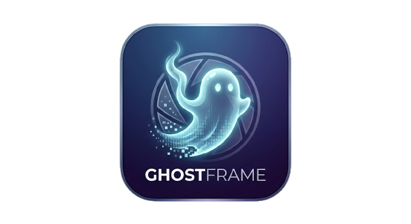

<div align="center">
  
  <h1>GhostFrame</h1>
  <p>
    
    
    
    
    
    
  </p>
  <p><strong>Create metadata-free images for social media.</strong></p>
  <p>A client-side image editor built for content creators who need clean, undetectable images — no EXIF, no fingerprints, no traces.</p>
</div>

---

## Why GhostFrame?

Social media platforms scan uploaded images for metadata (EXIF, XMP, C2PA) and use perceptual hashing to detect duplicates or AI-generated content. GhostFrame solves this by letting you compose images — quote overlays, filters, watermarks — and export them completely clean. Every export is a new image with zero metadata, processed entirely in your browser.

No server. No uploads. No data leaves your machine.

## Features

- **Drag & drop image loading** — supports JPG, PNG, and WebP
- **Quote text editor** — 5 curated fonts (Playfair Display, Montserrat, Lora, Cinzel, Raleway), adjustable size, color, position, and alignment
- **Author attribution** — optional citation line rendered below the quote
- **5 visual filters** — Stoic Dark, Marble, Golden Hour, Noir, Mist — each with adjustable intensity
- **Adaptive dark overlay** — gradient band behind text with configurable opacity
- **Watermark system** — upload your logo (PNG with transparency), control opacity, size, and position
- **3 export resolutions** — Low (1080×1080), Medium (1920×1080), High (2048×2048)
- **Anti-fingerprint noise grain** — imperceptible pixel noise applied on export to break perceptual hashing
- **Zero metadata output** — canvas-rendered exports contain no EXIF, GPS, software tags, or AI markers
- **100% client-side** — nothing is uploaded, processed, or stored on any server

## Tech Stack

| Layer       | Technology                  |
|-------------|-----------------------------|
| Framework   | React 19 + TypeScript       |
| Build       | Vite                        |
| Styling     | Tailwind CSS v4             |
| Rendering   | HTML Canvas API             |
| Fonts       | Self-hosted (SIL OFL)       |

## Getting Started

```bash
# Clone the repository
git clone https://github.com/a-ramirezzz/ghostframe.git
cd ghostframe

# Install dependencies
npm install

# Start development server
npm run dev
```

Open `http://localhost:5173` in your browser. That's it — no API keys, no environment variables, no backend.

## Export Details

Every exported image is:

| Property            | Value                                      |
|---------------------|--------------------------------------------|
| EXIF metadata       | None                                       |
| XMP metadata        | None                                       |
| C2PA/AI markers     | None                                       |
| GPS coordinates     | None                                       |
| Software tag        | None                                       |
| ICC Profile         | sRGB (standard browser profile)            |
| Noise grain         | Applied (imperceptible, anti-fingerprint)  |
| Format              | JPEG or PNG (user choice)                  |

## Project Structure

```
ghostframe/
├── src/
│   ├── components/
│   │   ├── Canvas/          # Image preview and canvas rendering
│   │   ├── Controls/        # Shared control components
│   │   ├── ExportPanel/     # Resolution, format, and download
│   │   ├── FilterPanel/     # Visual filter selection and preview
│   │   ├── FontPicker/      # Font selection
│   │   ├── Layout/          # App shell and sidebar
│   │   ├── TextEditor/      # Quote, author, and typography controls
│   │   └── WatermarkLayer/  # Logo upload and positioning
│   ├── hooks/                # State management hooks
│   ├── utils/                # Filters, rendering, noise, export
│   ├── types/                # TypeScript interfaces
│   └── assets/
│       ├── fonts/            # Self-hosted font files
│       └── watermarks/       # Watermark assets
├── public/
│   └── ghostframe-icon.png
├── FONT_LICENSES.md
└── README.md
```

## Contributing

GhostFrame is open source and contributions are welcome. Whether it's a bug fix, a new filter, font support, or a UI improvement — all PRs are appreciated.

See [CONTRIBUTING.md](CONTRIBUTING.md) for guidelines on how to get started.

## License

MIT
